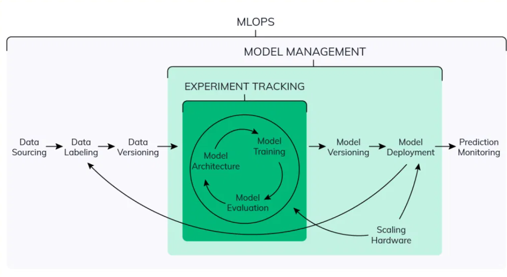

# Environment set up on Macbook and connect to SSH remote through Pycharm by Amber

# 1. Environment
## 1.1 Environment preparation
Development environment: Macbook

Please remember that as our remote environment runs on Linux while the local environment operates on MacOS, all the preparations for the remote environment should be on the Linux version.

After turn on your SSH remote server `ssh mlops(MY REMOTE NAME, replace it with yours)`, it shows: `Welcome to Ubuntu xxxxxx`. Then start the following preparations.

### Step 1: Download and install the Anaconda distribution of Python

```sh
wget https://repo.anaconda.com/archive/Anaconda3-2023.03-1-Linux-x86_64.sh

bash Anaconda3-2023.03-1-Linux-x86_64.sh
```

### Step 2: Update existing packages

```sh
sudo apt-get update
```

### Step 3: Install Docker

```sh
sudo apt install docker.io
```

To run docker without `sudo`:

```sh
sudo groupadd docker
sudo usermod -aG docker $USER
```

Since we want to manage Docker as a non-root user, `sudo` needs identity, requiring password everytime you run Docker.

### Step 4: Install Docker Compose

Install docker-compose in a separate directory

```sh
mkdir soft
cd soft
```

To get the latest release of Docker Compose, go to https://github.com/docker/compose and download the release for your OS.

```sh
wget https://github.com/docker/compose/releases/download/v2.5.0/docker-compose-linux-x86_64 -O docker-compose
```

Make it executable

```sh
chmod +x docker-compose
```
`chmod` changes the file mode.

Add to the `soft` directory to `PATH`. Open the `.bashrc` file with `nano`:

```sh
nano ~/.bashrc
```

In `.bashrc`, add the following line:

```bash
export PATH="${HOME}/soft:${PATH}"
```

Save it and run the following to make sure the changes are applied:

```bash
source ~/.bashrc
```


### Step 5: Run Docker

```sh
docker run hello-world
```

If you get `docker: Got permission denied while trying to connect to the Docker daemon socket at unix:///var/run/docker.sock: Post "http://%2Fvar%2Frun%2Fdocker.sock/v1.24/containers/create": dial unix /var/run/docker.sock: connect: permission denied.` error, restart your VM instance.

**Note**: If you get `It is required that your private key files are NOT accessible by others. This private key will be ignored.` error, you should change permits on the downloaded file to protect your private key:

 ```sh
chmod 400 name-of-your-private-key-file.pem
```

## 1.2 Connect your local environment(Pycharm) to `ssh` remote
### Step 1  

Fork Alexey's repository to yours, then jump to your repository and clone it to the remote environment.

```
git clone https://github.com/YOURNAME/mlops-zoomcamp.git
```
### Step 2
Open Pycharm, `File->Remote Development->Python Interpreter->SSH Connection->New Connection->setting`.

Enter the info we got for the HOST:
```
HOST: (Public IPv4 address of Your Instances on AWS)
USERNAME: (ubuntu)  
AUTHENTICATION TYPE: (Key pair)
```

**Note**: 
USERNAME should all be lower case.

`Key pair` for AUTHENTICATION TYPE should be the one you got for the instance on AWS: `/Users/YOURUSERNAME/.ssh/YOURSKEYPAIR.pem`. 
If you did not save the key pair in `~/.ssh`, please move it under this folder.

The Public IPv4 address will be reassigned everytime you restart the instance, which means,  you are required to update HOST infor everytime you start the instance.

Click on `test connection`, if successful, click on `ok`. 
Then `Check connection and Continue`.

### Step 3
Choose IDE and Project of your remote environment, `Project Directory` is under `home->ubuntu->Your cloned project`

Now you successfully connect to the remote environment. And you can directly connect to the Pycharm of the server remotely for development. 
Since all directories are on the remote server, there is no need to upload files synchronously back and forth, and you will not worry about not having a corresponding local path.


## 1.3 Edit remote jupyter notebook on your localhost
Open two Terminals, one is for remote control, another is for local environment.

### The one for Remote:
```
ssh mlops(change it with YOURREMOTE)
mkdir notebooks
cd notebooks
```

Jump to `./notebook`, then
```
jupyter notebook --no-browser --port=8889`
```


You can see the information for the port and token
```
 To access the notebook, open this file in a browser:
        file:///home/ubuntu/.local/share/jupyter/runtime/nbserver-41003-open.html
    Or copy and paste one of these URLs:
        http://localhost:8889/?token=6e2aab6cf19b61f3a51e509576a0837223b2128f6eeb71ce
     or http://127.0.0.1:8889/?token=6e2aab6cf19b61f3a51e509576a0837223b2128f6eeb71ce
```
on your screen.

***NOTE*** Type `exit` on screen or `Control(^) + D` can exit SSH remote.


### The one for Local control:
```ssh -N -f -L localhost:8888:localhost:8889 mlops(change it with YOURREMOTE)```

Enter `http://localhost:8888` on your browser. 
TOKEN can be found `http://localhost:8889/?token=6e2aab6cf19b61f3a51e509576a0837223b2128f6eeb71ce` from the information printed on one for remote control.

Now you can get access the jupyter notebook through your localhost, try to creat a new one and have fun!

You can also jump to `mlops-zoomcamp` folder from remote to edit the existed `duration-prediction.ipynb` on your localhost.

## 1.4 Training a ride duration prediction model

**Note**: The NYC taxi data is now in parquet format, not CSV.
Here's a [video](https://www.youtube.com/watch?v=r94QjpX9vSE&list=PL3MmuxUbc_hIUISrluw_A7wDSmfOhErJK) that explains how to 
read parquet data.

Prepare data:
```
cd mlops-zoomcamp/01-intro
mdir data/
cd data
```

The link to dataset(green_tripdata_2021-01): https://d37ci6vzurychx.cloudfront.net/trip-data/green_tripdata_2021-01.parquet

The link to dataset(green_tripdata_2021-02): https://d37ci6vzurychx.cloudfront.net/trip-data/green_tripdata_2021-02.parquet
```
wget https://d37ci6vzurychx.cloudfront.net/trip-data/green_tripdata_2021-01.parquet
wget https://d37ci6vzurychx.cloudfront.net/trip-data/green_tripdata_2021-02.parquet
```

Links:

* [Notebook](duration-prediction.ipynb)

## 1.5 What is MLops

## 1.6 Maturity models
Resources from: https://learn.microsoft.com/en-us/azure/architecture/example-scenario/mlops/mlops-maturity-model
### 1.6.1 Types of maturity models
0. No MLOps
Highlights:
- Difficult to manage full machine learning model lifecycle
- The teams are disparate and releases are painful
- Most systems exist as "black boxes," little feedback during/post deployment

Technology:
- Manual builds and deployments
- Manual testing of model and application
- No centralized tracking of model performance
- Training of model is manual
1. DevOps but no MLOps
Highlights:
- Releases are less painful than No MLOps, but rely on Data Team for every new model
- Still limited feedback on how well a model performs in production
- Difficult to trace/reproduce results
Technology:
- Automated builds
- Automated tests for application code
2. Automated training(2-3 ML cases)
Highlights:
- Training environment is fully managed and traceable
- Easy to reproduce model
- Releases are manual, but low friction
Technology:
- Automated model training
- Centralized tracking of model training performance
- Model management

3. Automated Model Deployment(*)
Highlights:
- Releases are low friction and automatic
- Full traceability from deployment back to original data
- Entire environment managed: train > test > production
Technology:
- Integrated A/B testing of model performance for deployment
- Automated tests for all code
- Centralized tracking of model training performance
  
4. Full MLOps Automated Operations
Highlights:
- Full system automated and easily monitored
- Production systems are providing information on how to improve and, in some cases, automatically improve with new models
- Approaching a zero-downtime system
Technology:
- Automated model training and testing
- Verbose, centralized metrics from deployed model
  
