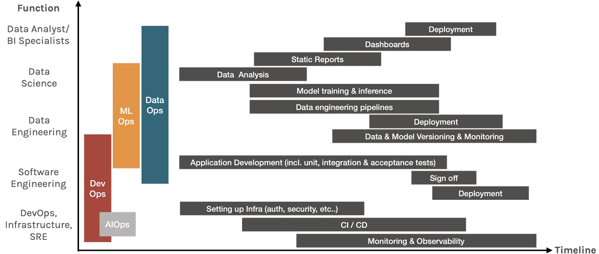

# 1. Why MLops
## 1.1 Difference of DataOps vs MLOps vs DevOps


***"MLOps delivers machine learning models faster"***

*A set of practices to design, build and manage reproducible, testable and sustainable ML-powered software. 
For Big Data/Machine Learning teams, MLOps incorporate most DataOps tasks and additional ML-specific tasks, such as model versioning, testing, validation and monitoring.*

1. Compliance
In the MLOps realm, industries such as finance and healthcare often require model explainability. 

🔧 Tools: PySyft decouples private data for model training, AirCloak for data anonymisation. Awesome AI Guidelines for a curation of principals, standards and regulations around AI.

2. Iterative Development

3. Reproducibility
Machine learning models are often retrained because of either data drift. In order to reproduce the results, MLOps need to version the model and DataOps need to version the data. When being asked by an auditor which data was used to train which model to produce this specific result, the data scientist needs to be able to answer that.

🔧 Tools: experiment tracking tools, such as KubeFlow, MLFlow or SageMaker all have functionalities that link metadata to the experiment run. Pachyderm and DVC for data versioning.

4. Testing
From ML perspective, model accuracy, security, bias/fairness, interpretability all need to be tested.

🔧 Tools: libraries such as Shap & Lime for interpretability, fiddler for explainability monitoring, great expectation for data testing.

5. Continuous Deployment
There are three components to the continuous deployment of machine learning models.

- The first component is the triggering event, i.e. is the trigger a manual trigger by a data scientist, a calendar schedule event and a threshold trigger?
- The second component is the actual retraining of the new model. What are the scripts, data and hyperparameters that resulted in the model? Their versions and how they are linked to one another.
- The last component is the actual deployment of the model, which must be orchestrated by the deployment pipeline with alerting in place.

🔧 Tools: most workflow management tools have this, such as AWS SageMaker, AzureML, DataRobot, etc. Open-source tools such as Seldon, Kubeflow KFServing.

6. Automation
Automation is the core-value of DevOps, and really there are a bunch of tools specialised in different aspects of automation. Here are some resources for machine learning projects:

Awesome Machine Learning https://github.com/josephmisiti/awesome-machine-learning

Awesome Production Machine Learning https://github.com/ethicalml/awesome-production-machine-learning

7. Monitoring
Software applications need to be monitored, so does machine learning model and the data pipeline. 
For DataOps, it’s important to monitor the new data’s distribution for any data and/or concept drift. On the MLOps side, in addition to model degradation, it is also paramount to monitor adversarial attacks if your model has a public API.

🔧 Tools: Most workflow management framework has some form of monitoring. Other popular tools include Prometheus for monitoring metrics, Orbit by Dessa for data & model monitoring.


***Reference:*** https://towardsdatascience.com/what-the-ops-are-you-talking-about-518b1b1a2694


# 2. Experiment tracking and model management

* [Slides](https://drive.google.com/file/d/1YtkAtOQS3wvY7yts_nosVlXrLQBq5q37/view?usp=sharing)

## 2.1 Experiment tracking intro
### MLflow

MLflow is an open source platform to manage the ML lifecycle, including experimentation, reproducibility, deployment, and a central model registry. 
MLflow currently offers four components:

- MLflow Tracking
Record and query experiments: 
  - code 
  - data
  - config
  - results

- MLflow Projects

    If a project contains multiple algorithms that can be run separately, in that multiple entry points are mentioned in MLProject file.

    Properties of a project:
  - Name - Name of the project 
  - Entry Points - Typically a .py or .sh file to run the entire project or some specific functionality, say an algorithm. List of entry points are mentioned in MLProject file 
  - Environment - Specifications such as library dependencies for the software environment for the code to run. Supported environments - conda environments, virtualenv environments, docker environments.

- MLflow Models

    A typical model directory contains the following files:

    - MLmodel - a YAML file describing model flavours, time created, run_id if the model was created in experiment tracking, signature denoting input and output details, input example, version of databricks runtime (if used) and mlflow version 
    - model.pkl - saved model pickle file 
    - conda.yaml - environment specifications for conda environment manager 
    - python_env.yaml - environment specification for virtualenv environment manager 
    - requirements.txt - list of pip installed libraries for dependencies
- Model Registry

    Model Registry concepts to manage life cycle of mlflow model:

    - Model - An mlflow model logged with one of the flavours mlflow.<model_flavour>.log_model()
    - Registered model - An mlflow model registered on Model Registry. It has a unique name, contains versions, transitional stages, model lineage and other associated metadata. 
    - Model Version - Version of the registered model 
    - Model Stage - Each distinct model version can be associated with one stage at a time. Stages supported are Staging, Production and Archived. 
    - Annotations and descriptions - Add useful information such as descriptions, data used, methodology etc. to the registered model.

***Ref:***  https://www.mlflow.org/

## 2.2 Getting started with MLflow
***Note*** *Run in the local environment.*
### Prepare the environment ###
Run the following command to create a fresh new new conda virtual environment.  
```conda create -n exp-tracking-env python=3.9```
  
Next we activate the newly created environment.  
```conda activate exp-tracking-env```
  
Install the required packages listed in requirements.txt file.  
```pip install -r requirements.txt```

Launch mlflow ui as well. Run the following command to start mlflow ui (a gunicorn server) connected to the backend sqlite database.  
```mlflow ui --backend-store-uri sqlite:///mlflow.db```

To access mlflow ui open `https://127.0.0.1:5000` in your browser.

## Note for MLflow tracking:
An MLflow tracking server has two components for storage: a backend store and an artifact store.

The backend store is where MLflow Tracking Server stores experiment and run metadata as well as params, metrics, and tags for runs. MLflow supports two types of backend stores: file store and database-backed store.

Use `--backend-store-uri` to configure the type of backend store. You specify a file store backend as `./path_to_store` or `file:/path_to_store` and a database-backed store as SQLAlchemy database URI. 
The database URI typically takes the format `<dialect>+<driver>://<username>:<password>@<host>:<port>/<database>`. MLflow supports the database dialects ***mysql, mssql, sqlite***, and ***postgresql***. 
Drivers are optional. If you do not specify a driver, SQLAlchemy uses a dialect’s default driver. For example, `--backend-store-uri sqlite:///mlflow.db` would use a local SQLite database.

By default `--backend-store-uri` is set to the local `./mlruns` directory (the same as when running `mlflow run` locally), but when running a server, make sure that this points to a persistent (that is, non-ephemeral) file system location.

The artifact store is a location suitable for large data (such as an S3 bucket or shared NFS file system or as our use case: HDFS ) and is where clients log their artifact output (for example, models). artifact_location is a property recorded on mlflow.entities.Experiment for default location to store artifacts for all runs in this experiment. Additional, artifact_uri is a property on mlflow.entities.RunInfo to indicate location where all artifacts for this run are stored.

Use --default-artifact-root (defaults to local ./mlruns directory) to configure default location to server’s artifact store. This will be used as artifact location for newly-created experiments that do not specify one. Once you create an experiment, --default-artifact-root is no longer relevant to that experiment.

## 2.3 Experiment tracking with MLflow
Linear model:
[duration-prediction.ipynb](01_ linear.ipynb)


Xgboost:
[xgboost.ipynb](02_xgboost.ipynb)


Ensemble:
[ensemble.ipynb](03_ensemble.ipynb)


## 2.4 Model management
* Load model as an artifact:
`mlflow.log_artifact("models/preprocessor.b", artifact_path="preprocessor")`

* Log model using the method `log_model`:
`mlflow.<framework>.log_model(model, artifact_path = "models/")`

Examples are in [xgboost.ipynb](02_xgboost.ipynb):

## 2.5 Model registry
[Model Registry](https://mlflow.org/docs/latest/model-registry.html) is to manage life cycle of mlflow model for improving efficiency in developing:


The concepts should be known:
* Model - An mlflow model logged with one of the flavours `mlflow.<model_flavour>.log_model()`
* Registered model - An mlflow model registered on Model Registry. It has a unique name, contains versions, transitional stages, model lineage and other associated metadata. 
* Model Version - Version of the registered model 
* Model Stage - Each distinct model version can be associated with one stage at a time. Stages supported are Staging, Production and Archived. 
* Annotations and descriptions - Add useful information such as descriptions, data used, methodology etc. to the registered model.

[Two workflow](https://mlflow.org/docs/latest/model-registry.html) for it, one is from UI, the other is from API.

1). UI workflow;

2). API workflow: [model-registry.ipynb](04_model-registry.ipynb)

Explaining workflow:
- Adding an MLflow Model to the Model Registry

- Fetching an MLflow Model from the Model Registry

- Serving an MLflow Model from Model Registry

- Adding or Updating an MLflow Model Descriptions

- Renaming an MLflow Model

- Transitioning an MLflow Model’s Stage

- Listing and Searching MLflow Models

- Archiving an MLflow Model

- Deleting MLflow Models

- Registering a Model Saved Outside MLflow

- Registering an Unsupported Machine Learning Model

- Using Registered Model Aliases


## 2.6 MLflow in practice
Depending upon the project and number of data scientists going to collaborate, the configurational aspect of mlflow is decided. Consider the following three scenarios:

- A single data scientist participating in a competition
[scenario-1.ipynb](running-mlflow-examples%2Fscenario-1.ipynb)
- A cross-functional team with single data scientist
[scenario-2.ipynb](running-mlflow-examples%2Fscenario-2.ipynb)
- Multiple data scientists working together on models
[scenario-3.ipynb](running-mlflow-examples%2Fscenario-3.ipynb)
## 2.7 MLflow: benefits, limitations and alternatives

- Benefits

    - Share and collaborate with other members
    - More visibility into all the efforts
- Limitations

  - Security - restricting access to the server
  - Scalability
  - Isolation - restricting access to certain artifacts
- When not to use

  - Authentication and user profiling is required
  - Data versioning - no in-built functionality but there are work arounds
  - Model/Data monitoring and alerts are required
- Alternates

  - Nepture.ai
  - Comet.ai
  - Weights and Biases
  - etc


